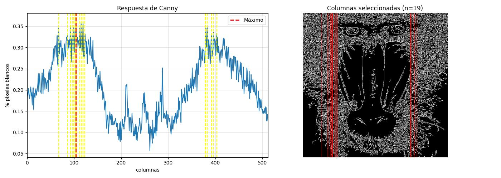
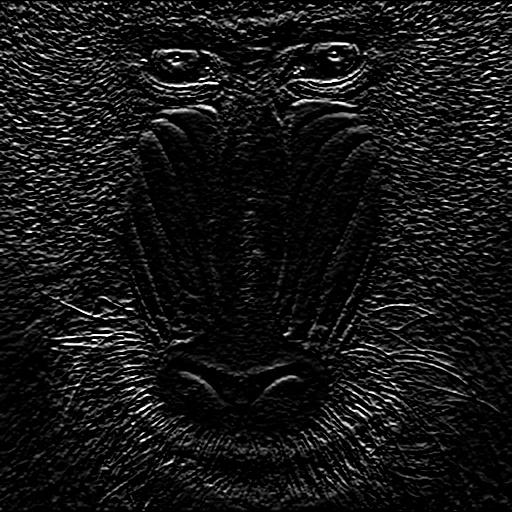
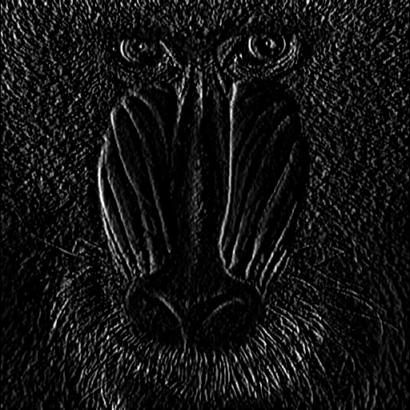
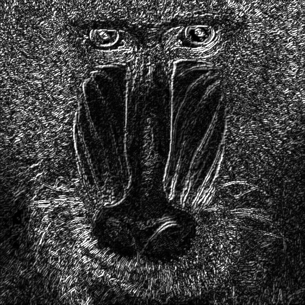
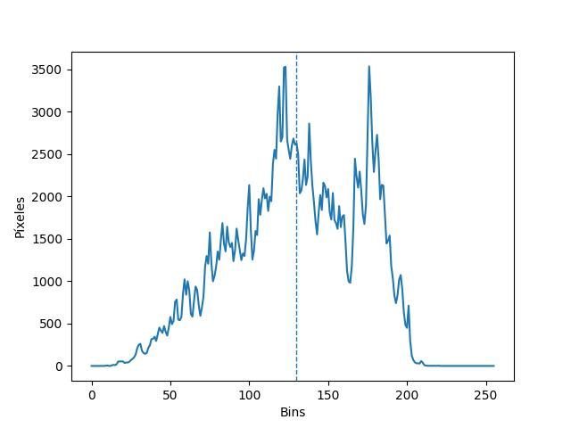
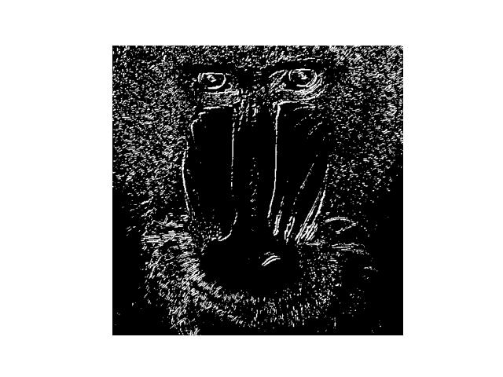
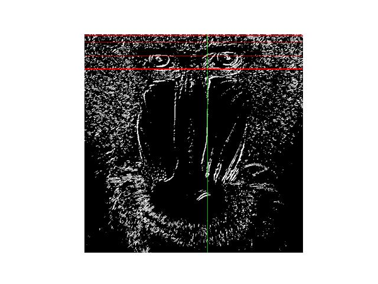
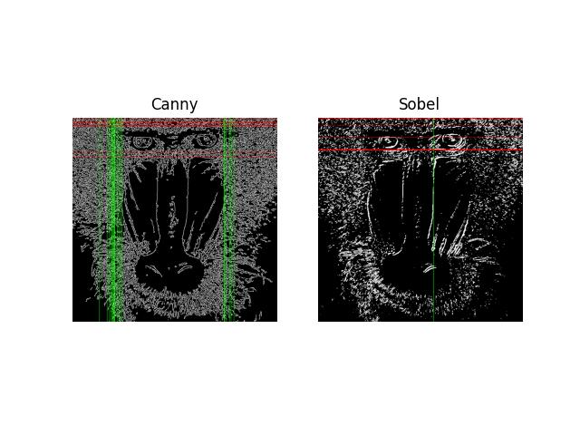
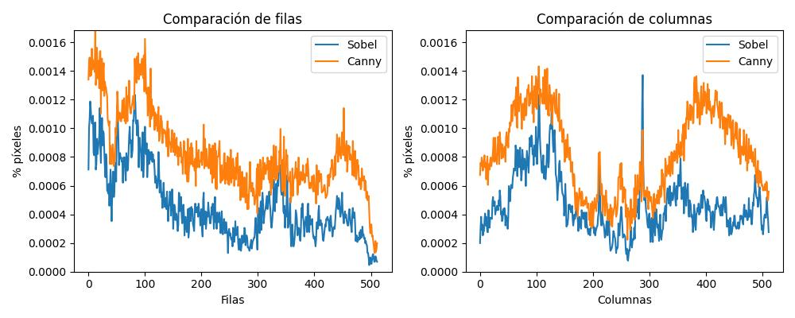

<h1 align="center">Práctica 1</h1>

<h2 align="center">Asignatura: Visión por Computador</h2>

Universidad de Las Palmas de Gran Canaria  
Escuela de Ingeniería en Informática  
Grado de Ingeniería Informática  
Curso 2025/2026 

<h2 align="center">Autores</h2>

- Asmae Ez Zaim Driouch
- Javier Castilla Moreno

<h2 align="center">Bibliotecas utilizadas</h2>

[](https://numpy.org/)
[](https://opencv.org/)
[](https://matplotlib.org/)
[](https://pypi.org/project/pillow/)


## Cómo usar
### Primer paso: clonar este repositorio
```bash
git clone "https://github.com/A-NullPointer/VC-P2"
```
### Segundo paso: Activar tu envinroment e instalar dependencias
> [!NOTE]
> Todas las dependencias pueden verse en [este archivo](envinronment.yml). Si se desea, puede crearse un entorno de Conda con dicho archivo.

Si se opta por crear un nuevo `Conda envinronment` a partir del archivo expuesto, es necesario abrir el `Anaconda Prompt` y ejecutar lo siguiente:

```bash
conda env create -f environment.yml
```

Posteriormente, se activa el entorno:

```bash
conda activate VC_P2
```

### Tercer paso: ejecutar el cuaderno
Finalmente, abriendo nuestro IDE favorito y teniendo instalado todo lo necesario para poder ejecutar notebooks, se puede ejecutar el cuaderno de la práctica [Practica2.ipynb](Practica2.ipynb) seleccionando el envinronment anteriormente creado.

> [!IMPORTANT]
> Todos los bloques de código deben ejecutarse en órden, de lo contrario, podría ocasionar problemas durante la ejecución del cuaderno.

<h1 align="center">Tareas</h1>

<h2 align="center">Tarea 1: Contar píxeles no nulos en cada fila haciendo un conteo de aquellas que tienen un valor obtenido mayor o igual al 90% del máximo usando Canny</h2>

Se aplica el operador de Canny para detectar bordes en la imagen en escala de grises:

```python
gris = cv2.cvtColor(img, cv2.COLOR_BGR2GRAY)
canny = cv2.Canny(gris, 100, 200)
```
Se normaliza el conteo de píxeles blancos dividiendo por el valor máximo del píxel (255) y el número de columnas:

```python
row_counts = cv2.reduce(canny, 1, cv2.REDUCE_SUM, dtype=cv2.CV_32SC1).flatten()
row = row_counts / (255 * canny.shape[1])
```

Se determina el valor máximo de píxeles blancos por fila y se establecen las filas que superan el 90% de este máximo:

```python
umbral = 0.9 * max_row
filas_seleccionadas = np.where(row >= umbral)[0]
```

Las filas seleccionadas se marcan en rojo sobre la imagen de Canny para visualizar las regiones con mayor concentración de bordes horizontales.


De manera similar, se realiza el análisis por columnas:

```python
col_counts = cv2.reduce(canny, 0, cv2.REDUCE_SUM, dtype=cv2.CV_32SC1)
cols = col_counts[0] / (255 * canny.shape[0])
```

Se identifican las columnas que superan el 90% del valor máximo y se marcan sobre la imagen.

<h3 align="center"> Resultados </h3>

Los histogramas muestran la distribución de bordes detectados:




<h2 align="center">Tarea 2: Aplicar umbralizado a imagen resulante de sobel. Posteriormente, contar filas y columnas con píxeles no nulos, remarcando aquellas que tengan un valor mayor al 90% del máximo. Canny vs Sobel</h2>

Para realizar esta tarea, se ha usado la misma imagen del mandril leída de disco anteriormente para posteriormente aplicar Sobel y a continuación umbralizar la imagen.

```python
gaussian_image = cv2.GaussianBlur(cv2.cvtColor(image, cv2.COLOR_RGB2GRAY), (3, 3), 0)
sobel_y = cv2.Sobel(gaussian_image, cv2.CV_64F, 0, 1)
sobel_x = cv2.Sobel(gaussian_image, cv2.CV_64F, 1, 0)
sobel = cv2.convertScaleAbs(cv2.add(sobel_x, sobel_y))
```

Primero se ha aplicado un filtro Gaussiano, que nos difuminará ligeramente la imagen eliminando el ruido para posteriormente, aplicar Sobel en vertical y horizontal. Finalmente se juntan los resultados y se obtiene la imagen de Sobel con bordes verticales y horizontales.

> [!IMPORTANT]
> Es necesario pasar el resultado a 8 bits, de los contrario, los valores de los píxeles podrían salirse del rango (0, 255).

A continuación se muestra el resultado:

<table align="center">
   <td>
      <h3 align="center">Sobel horizontal</h3>
      
   </td>
   <td>
      <h3 align="center">Sobel vertical</h3>
      
    </td>
   <td>
      <h3 align="center">Sobel combinado</h3>
                                                   
    </td>
</table>

Posteriormente, para obtener el umbral necesario, se ha calculado el histograma de esta imagen a la que se le ha aplicado Sobel con ayuda de la función `cv2.calcHist` de OpenCV:

```python
histogram = cv2.calcHist([cv2.cvtColor(image, cv2.COLOR_RGB2GRAY)], [0], None, [256], [0, 256])
```

Y este es el histograma resultante:

<div align="center">
    
</div>

En el valle situado entre los dos picos del histograma, podemos encontrar el umbral necesario.

> [!NOTE]
> Puede sumarse `cv2.THRES_OTSU` al realizar el umbralizado con ayuda de OpenCV para obtener un umbral de manera automática. Posteriormente será utilizado en el demostrador. Sin embargo, en este punto se ha decidio utilizar un valor seleccionado a ojo en ese valle.

Una vez obtenemos el umbral que necesitábamos, aplicamos el umbralizado a la imagen de sobel con la función `cv2.thresold`:

```python
threshold = 130

_, threshold_image = cv2.threshold(cv2.cvtColor(image, cv2.COLOR_RGB2GRAY), threshold, 255, cv2.THRESH_BINARY)
```

El resultado obtenido es el siguiente:

<div align="center">
    
</div>

Tras umbralizar la imagen, podemos seguir con la tarea. Ahora, se intenta contar las filas y columnas con valores no nulos de la imagen resultante para posteriormente, marcar en la misma aquellas que superen el 90% del máximo de píxeles encontrados en una fila / columna.

Para lograr lo descrito anteriormente, se ha recurrido a la función `np.count_nonzero` de Numpy, la cual es perfecta para esta situación, pues nos dará un array donde cada valor corresponde al número de píxeles no nulos en dicha fila / columna. La función desarrollada para tal fin es la siguiente:

```python
def statistics(image, p, axis):
    counts = np.count_nonzero(image, axis=axis)
    max_index = np.argmax(counts)
    max_value = counts[max_index]
    threshold = p*max_value
    return counts, max_index, max_value, {i: int(counts[i]) for i in range(len(counts)) if counts[i] > threshold}
```

A la función le pasamos como parámetros la propia imagen, el porcentaje objetivo y el eje (filas / columnas).

> [!NOTE]
> Para encontrar la posición y el valor máximo se ha hecho uso de la función `np.argmax`de Numpy, la cual devuelve el índice del elemento con el valor máximo dentro del array.

Seguidamente, hacemos el conteo de aquellas filas y columnas con valores por encima del 90% del máximo:

```python
counts_rows_sobel, max_row_index_sobel, max_row_value_sobel, rows_sobel = statistics(threshold_image_sobel, .9, 1)
counts_columns_sobel, max_column_index_sobel, max_column_value_sobel, columns_sobel = statistics(threshold_image_sobel, .9, 0)
```

Los resultados obtenidos son los siguientes:

```
-------------Filas-------------
La fila con índice 82 tiene el valor máximo con 161 píxeles blancos
Las filas que tienen un valor mayor al 90% del máximo son las siguientes:
	Fila 3 con valor 155
	Fila 4 con valor 149
	Fila 20 con valor 149
	Fila 51 con valor 151
	Fila 81 con valor 152
	Fila 82 con valor 161
	Fila 83 con valor 154
------------Columnas-----------
La columna con índice 288 tiene el valor máximo con 179 píxeles blancos
Las columnas que tienen un valor mayor al 90% del máximo son las siguientes:
	Columna 288 con valor 179
```

> [!NOTE]
> Los datos extras no utilizados actualmente nos servirán en la comparación posterior con Canny.

Tras obtener estos datos, podemos remarcar dichos ejes que cumplan la condición planteada en esta tarea usando primitivas gráficas de OpenCV del siguiente modo:

```python
threshold_image_marked = cv2.cvtColor(threshold_image_sobel, cv2.COLOR_GRAY2RGB)

draw_rows_and_columns(threshold_image_marked, rows_sobel, columns_sobel)
```

La función utilizada para dibujar dichas primitivas gráficas es la siguiente:

```python
def draw_rows_and_columns(image, rows, columns):
    h, w, *_ = image.shape
    for row in rows.keys():
        cv2.line(image, (0, row), (w, row), (255, 0, 0), 1)

    for col in columns.keys():
        cv2.line(image, (col, 0), (col, h), (0, 255, 0), 1)
```

A continuación se muestra el resultado:

<div align="center">
    
</div>

Finalmente, lo compararemos con Canny. Se han seguido los mismos procedimientos que en el caso de Sobel y este es el resultado:

<div align="center">
    
</div>

Como se puede observar, en el caso de Canny es donde más filas y columnas se han remarcado, y también es donde mayor número de píxeles hay. A continuación, se muestra la comparación gráfica de ambos casos para el conteo de sus filas y columnas con valores no nulos:

<div align="center">
    
</div>

Con estas gráficas, puede apreciarse mucho mejor como Canny posee un mayor número de píxeles no nulos en cada fila y columna en comparación con Sobel.

<h2 align="center">Tarea 3: Demostrador</h2>

Para el desarrollo de este demostrador, se ha reutilizado la clase desarrollada en la práctica anterior para aplicar transformaciones a los canales de una imagen, ampliando sus métodos para añadir nuevas formas de modificar la imagen con conceptos aprendidos en estas dos prácticas. Además, se ha englobado todo ello en una pequeña aplicación usando la biblioteca gráfica de python, `Tkinter`.

Los nuevos métodos son los siguientes:

```python
@staticmethod
def canny_inverted(image, *args):
    return Demo.negative_image(cv2.Canny(cv2.cvtColor(image, cv2.COLOR_BGR2GRAY), 50, 200))
    
@staticmethod
def sobel(image, *args):
    gaussian_image = cv2.GaussianBlur(cv2.cvtColor(image, cv2.COLOR_BGR2GRAY), (3, 3), 0)
    sobel_y = cv2.Sobel(gaussian_image, cv2.CV_64F, 0, 1)
    sobel_x = cv2.Sobel(gaussian_image, cv2.CV_64F, 1, 0)
    return cv2.convertScaleAbs(cv2.add(sobel_x, sobel_y))
    
@staticmethod
def isolate_color(image, mask1, mask2):
    hsv = cv2.cvtColor(image, cv2.COLOR_BGR2HSV)
    mask = cv2.inRange(hsv, mask1, mask2)
    color_part = cv2.bitwise_and(image, image, mask=mask)
    gray = cv2.cvtColor(image, cv2.COLOR_BGR2GRAY)
    gray_bgr = cv2.cvtColor(gray, cv2.COLOR_GRAY2BGR)
    return np.where(mask[:, :, None] != 0, color_part, gray_bgr)
    
@staticmethod
def threshold_function(image, *args):
    gray = cv2.cvtColor(image, cv2.COLOR_BGR2GRAY)
    _, threshold_image = cv2.threshold(gray, 0, 255, cv2.THRESH_BINARY + cv2.THRESH_OTSU)
    return threshold_image
```

En concreto, se han añadido utilizades para:
- Hacer un collage con inversión completa de los colores de la imagen e inversión individual de cada canal de la misma
- Aplicar Canny a cada fotograma e invertir la misma, consiguiendo un efecto de dibujo
- Aplicar Canny a cada fotograma, mostrando los bordes con su respectivo color de la imagen original
- Resaltar los objetos con valores HSV seleccionados, dejando el resto de la imagen en escala de grises
- Aplicar Sobel a cada fotograma
- Aplicar umbralizado a cada fotograma
- Efecto Cartoon aplicando Canny y disminución de bits en cada canal
- 

> [!NOTE]
> Los controles de la aplicación pueden verse en la misma ventana de ejecución. El modo actual será mostrado justo encima del vídeo. Ademaás, en la zona derecha de la ventana pueden verse los controles para modificar los valores de los rangos para HSV.

A continuación, se muestran todos los modos disponibles en funcionamiento:

<table align="center">
    <tr>
        <td>
            <h3 align="center">Collage de inversiones</h3>
                                                         
        </td>
        <td>
            <h3 align="center">Canny y efecto dibujo</h3>
                                                         
        </td>
        <td>
            <h3 align="center">Canny colorido</h3>
                                                         
        </td>
        <td>
            <h3 align="center">HSV y rangos 1</h3>
                                                         
        </td>
    </tr>
    <tr>
        <td>
            <h3 align="center">HSV y rangos 2</h3>
                                                         
        </td>
        <td>
            <h3 align="center">Sobel para efecto relieve</h3>
                                                         
        </td>
        <td>
            <h3 align="center">Umbralizado</h3>
                                                         
        </td>
        <td>
            <h3 align="center">Efecto Cartoon</h3>
                                                         
        </td>
    </tr>
</table>

> [!NOTE]
> El código de la aplicación puede verse en el cuaderno [Practica2.ipynb](Practica2.ipynb).

<h2 align="center">Tarea 4: Reinterpretaciones</h2>

Con el fin de fomentar el aprendizaje y dejar volar nuestra imaginación, hemos decidido que cada miembro del grupo desarolle su propia interpretación. Por ello, se ha realizado un `Pincel Virtual` (`Tarea 4a`) y `Pintar con Movimiento` (`Tarea 4b`). A continuación, se presentara la primera parte de esta tarea.

<h2 align="center">Tarea 4a: Reinterpretación de Air Guitar: Pincel Virtual</h2>

En concreto, se ha seleccionado el color rojo para ser nuestro pincel virtual. La pequeña aplicación desarrollada en `Tkinter` permite capturar la imagen desde la webcam del ordenador para posteriormente, con ayuda de nuestro rotulador de tapa roja, empezar a dibujar sobre dicha imagen capturada.

> [!NOTE] 
> Para desarrollar el pincel virtual, se ha hecho uso del espacio de colores `HSV`, el cual permite, con ayuda de funciones de
`OpenCV`, detertar rangos de colores con el fin de aislar o detectar los mismos en cada fotograma.

A la hora de realizar esta interpretación surgió un problema, y era cómo detectar la posición del objeto rojizo en la imagen. Investigando en la documentación de `OpenCV`, se ha encontrado una función capaz de encontrar contornos y posteriormente, encerrarlo en un rectángulo, obteniendo las coordenadas X e Y del mismo así como su altura y ancho. Dichas funciones son `cv2.findContours` y `cv2.boundingRect` respectivamente. Con esto, se tiene todo lo necesario para empezar a simular un pincel virtual detectando un objeto rojizo.

> [!NOTE] 
> Dependiendo de la altura del objeto usado como pincel, el grosor de la pincelada virtual aumentará o disminuirá. Además, la aplicación permite observar la imagen tomada originalmente sobre la que también se superpondrá el objeto detectado como pincel, qué es lo que se está detectando que podría ser detectado como el pincel virtual, el lienzo resultante de las pinceladas, y la combinación del lienzo sobre la imagen original. Con todo esto, la diversión siempre estará presente.

A continuación, se muestran varios ejemplos de uso de esta interpretación realizada:

<table align="center">
    <tr>
        <td>
            
        </td>
        <td>
            
        </td>
    </tr>
    <tr>
        <td>
            
        </td>
        <td>
            
        </td>
    </tr>
</table>

> [!NOTE]
> Se pueden borrar los trazos realizados con la tecla BACKSPACE. El código de la aplicación puede verse en el cuaderno [Practica2.ipynb](Practica2.ipynb).


<h2 align="center">Tarea 4b: Estela con movimiento</h2>

Inspirado en la instalación interactiva "Messa di Voce", este demostrador permite pintar con el movimiento detectado por la cámara.

### Concepto

- El movimiento deja "pintura" en pantalla
- Diferentes intensidades de movimiento generan diferentes colores
- Los bordes del movimiento se resaltan
- La pintura se desvanece gradualmente si no hay movimiento

### Detección de movimiento

```python
def detectar_movimiento(frame_actual, frame_prev, umbral=25):
    gris_actual = cv2.cvtColor(frame_actual, cv2.COLOR_BGR2GRAY)
    gris_prev = cv2.cvtColor(frame_prev, cv2.COLOR_BGR2GRAY)
    
    gris_actual = cv2.GaussianBlur(gris_actual, (5, 5), 0)
    gris_prev = cv2.GaussianBlur(gris_prev, (5, 5), 0)
    
    diff = cv2.absdiff(gris_actual, gris_prev)
    _, mask = cv2.threshold(diff, umbral, 255, cv2.THRESH_BINARY)
    
    kernel = np.ones((5, 5), np.uint8)
    mask = cv2.morphologyEx(mask, cv2.MORPH_OPEN, kernel)
    mask = cv2.morphologyEx(mask, cv2.MORPH_CLOSE, kernel)
    
    return mask, diff
```

El algoritmo:
1. Convierte ambos frames a escala de grises
2. Aplica suavizado Gaussiano para reducir ruido
3. Calcula la diferencia absoluta entre frames
4. Umbraliza para obtener máscara binaria de movimiento
5. Aplica operaciones morfológicas para limpiar ruido

### Generación de colores

```python
def aplicar_colores_movimiento(mask, intensidad, frame_shape):
    h, w = frame_shape[:2]
    
    global contador_frames
    hue = (contador_frames % 180)
    
    color_frame = np.zeros((h, w, 3), dtype=np.uint8)
    color_frame[:, :, 0] = hue  # Hue
    color_frame[:, :, 1] = 255  # Saturación máxima
    color_frame[:, :, 2] = np.clip(intensidad * 3, 0, 255).astype(np.uint8)
    
    mask_3d = cv2.cvtColor(mask, cv2.COLOR_GRAY2BGR)
    color_frame = cv2.bitwise_and(color_frame, mask_3d)
    
    color_bgr = cv2.cvtColor(color_frame, cv2.COLOR_HSV2BGR)
    return color_bgr
```

El color cambia cíclicamente a través del espectro HSV:
- **Hue**: Rotación continua (efecto arcoíris)
- **Saturación**: Máxima (255)
- **Value**: Proporcional a la intensidad del movimiento

### Detección de bordes del movimiento

```python
def detectar_bordes_movimiento(mask):
    bordes = cv2.Canny(mask, 50, 150)
    
    kernel = np.ones((3, 3), np.uint8)
    bordes = cv2.dilate(bordes, kernel, iterations=1)
    
    return bordes
```

Se aplica Canny sobre la máscara de movimiento y se dilatan los bordes para hacerlos más visibles en color blanco brillante.

### Actualización del canvas

```python
def procesar_frame(frame, frame_prev):
    global canvas, contador_frames
    
    if canvas is None:
        canvas = np.zeros((h, w, 3), dtype=np.uint8)
    
    mask_movimiento, diff = detectar_movimiento(frame, frame_prev, UMBRAL_MOVIMIENTO)
    intensidad = calcular_intensidad_movimiento(diff)
    color_movimiento = aplicar_colores_movimiento(mask_movimiento, intensidad, frame.shape)
    
    bordes = detectar_bordes_movimiento(mask_movimiento)
    bordes_bgr = cv2.cvtColor(bordes, cv2.COLOR_GRAY2BGR)
    bordes_bgr[bordes > 0] = [255, 255, 255]
    
    canvas = (canvas * DECAY_RATE).astype(np.uint8)
    canvas = cv2.add(canvas, color_movimiento)
    canvas = cv2.add(canvas, bordes_bgr)
    
    contador_frames += 2
    return canvas
```

El canvas se actualiza aplicando:
1. **Desvanecimiento**: Multiplicación por `DECAY_RATE` (0.95)
2. **Nuevo movimiento**: Adición del color generado
3. **Bordes**: Adición de bordes blancos brillantes

### Controles interactivos

- **ESC**: Salir
- **SPACE**: Limpiar canvas
- **+ / -**: Ajustar sensibilidad del movimiento
- **d / D**: Ajustar velocidad de desvanecimiento

### Parámetros configurables

```python
UMBRAL_MOVIMIENTO = 25  # Sensibilidad de detección (5-100)
DECAY_RATE = 0.95       # Velocidad de desvanecimiento (0.85-0.99)
COLOR_INTENSIDAD = 180  # Intensidad máxima de color
```

- **UMBRAL_MOVIMIENTO**: Valores bajos detectan movimientos sutiles
- **DECAY_RATE**: Valores cercanos a 1 hacen que la pintura persista más tiempo
- **COLOR_INTENSIDAD**: Controla el brillo máximo de los colores


<h2 align="center"> Bibliografía </h2>

- [Repositorio base y enunciado de esta práctica](https://github.com/otsedom/otsedom.github.io/tree/main/VC/P2)
- [OpenCV Canny Edge Detection](https://docs.opencv.org/4.x/da/d22/tutorial_py_canny.html)
- [OpenCV Sobel Derivatives](https://docs.opencv.org/4.x/d2/d2c/tutorial_sobel_derivatives.html)
- [OpenCV Morphological Transformations](https://docs.opencv.org/4.x/d9/d61/tutorial_py_morphological_ops.html)
- [NumPy Array Manipulation](https://numpy.org/doc/stable/reference/routines.array-manipulation.html)
- [Messa di Voce - Interactive Installation](https://youtu.be/GfoqiyB1ndE)
