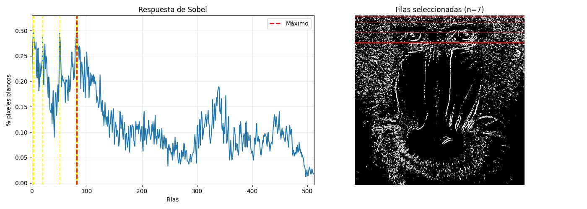
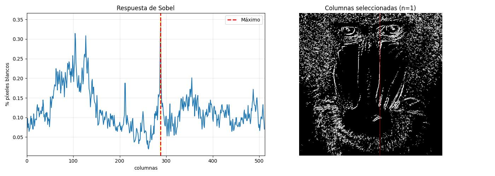

<h1 align="center">Práctica 1</h1>

<h2 align="center">Asignatura: Visión por Computador</h2>

Universidad de Las Palmas de Gran Canaria  
Escuela de Ingeniería en Informática  
Grado de Ingeniería Informática  
Curso 2025/2026 

<h2 align="center">Autores</h2>

- Asmae Ez Zaim Driouch
- Javier Castilla Moreno

<h2 align="center">Bibliotecas utilizadas</h2>

[](https://numpy.org/)
[](https://opencv.org/)
[](https://matplotlib.org/)
[](https://pypi.org/project/pillow/)


## Cómo usar
### Primer paso: clonar este repositorio
```bash
git clone "https://github.com/A-NullPointer/VC-P2"
```
### Segundo paso: Activar tu envinroment e instalar dependencias
> [!NOTE]
> Todas las dependencias pueden verse en [este archivo](envinronment.yml). Si se desea, puede crearse un entorno de Conda con dicho archivo.

Si se opta por crear un nuevo `Conda envinronment` a partir del archivo expuesto, es necesario abrir el `Anaconda Prompt` y ejecutar lo siguiente:

```bash
conda env create -f environment.yml
```

Posteriormente, se activa el entorno:

```bash
conda activate VC_P2
```

### Tercer paso: ejecutar el cuaderno
Finalmente, abriendo nuestro IDE favorito y teniendo instalado todo lo necesario para poder ejecutar notebooks, se puede ejecutar el cuaderno de la práctica [Practica2.ipynb](Practica2.ipynb) seleccionando el envinronment anteriormente creado.

> [!IMPORTANT]
> Todos los bloques de código deben ejecutarse en órden, de lo contrario, podría ocasionar problemas durante la ejecución del cuaderno.

<h1 align="center">Tareas</h1>

<h2 align="center">Tarea 1: Contar píxeles no nulos en cada fila haciendo un conteo de aquellas que tienen un valor obtenido mayor o igual al 90% del máximo usando Canny</h2>

Se aplica el operador de Canny para detectar bordes en la imagen en escala de grises:

```python
gris = cv2.cvtColor(img, cv2.COLOR_BGR2GRAY)
canny = cv2.Canny(gris, 100, 200)
```
Se normaliza el conteo de píxeles blancos dividiendo por el valor máximo del píxel (255) y el número de columnas:

```python
row_counts = cv2.reduce(canny, 1, cv2.REDUCE_SUM, dtype=cv2.CV_32SC1).flatten()
row = row_counts / (255 * canny.shape[1])
```

Se determina el valor máximo de píxeles blancos por fila y se establecen las filas que superan el 90% de este máximo:

```python
umbral = 0.9 * max_row
filas_seleccionadas = np.where(row >= umbral)[0]
```

Las filas seleccionadas se marcan en rojo sobre la imagen de Canny para visualizar las regiones con mayor concentración de bordes horizontales.


De manera similar, se realiza el análisis por columnas:

```python
col_counts = cv2.reduce(canny, 0, cv2.REDUCE_SUM, dtype=cv2.CV_32SC1)
cols = col_counts[0] / (255 * canny.shape[0])
```

Se identifican las columnas que superan el 90% del valor máximo y se marcan sobre la imagen.

<h3 align="center"> Resultados </h3>

Los histogramas muestran la distribución de bordes detectados:


<h2 align="center">Tarea 2: </h2>

Esta tarea aplica el operador de Sobel para detectar bordes y compara los resultados con el detector de Canny.

### Aplicación del operador Sobel

Se calcula el gradiente en ambas direcciones y se combinan:

```python
ggris = cv2.GaussianBlur(gris, (3, 3), 0)
sobelx = cv2.Sobel(ggris, cv2.CV_64F, 1, 0)  # Gradiente en x
sobely = cv2.Sobel(ggris, cv2.CV_64F, 0, 1)  # Gradiente en y
sobel = cv2.add(sobelx, sobely)
```

Se aplica un suavizado Gaussiano previo para reducir el ruido antes del cálculo del gradiente.

### Umbralización

La imagen resultante de Sobel se convierte a 8 bits y se umbraliza:

```python
sobel8 = cv2.convertScaleAbs(sobel)
_, imagenUmbralizada = cv2.threshold(sobel8, 130, 255, cv2.THRESH_BINARY)
```

El valor de umbral utilizado es **130**, que permite obtener bordes prominentes eliminando respuestas débiles.

### Análisis de filas y columnas

Se aplica el mismo proceso de conteo y análisis que en la Tarea 1, identificando filas y columnas que superan el 90% del valor máximo de píxeles blancos.





### Comparativa Sobel vs Canny

**Similitudes:**
- Ambos detectan bordes principales de la imagen
- Identifican regiones similares con alta concentración de bordes

**Diferencias:**
- **Canny**: Produce bordes más finos y continuos, mejor localización
- **Sobel**: Genera bordes más gruesos, mayor sensibilidad al ruido
- **Canny**: Mayor precisión en la detección de contornos
- **Sobel**: Detecta también cambios de intensidad menos pronunciados


<h2 align="center">Tarea 3: </h2>

Se propone un demostrador que captura imágenes de la cámara y permite aplicar diferentes procesamientos visuales en tiempo real.

### Modo 1: Bordes coloreados (Colored Edges)

Este modo combina detección de bordes con posterización de colores para crear un efecto artístico.

#### Detección de bordes con Canny

```python
def border_canny(frame, linf, lsup):
    gris = cv2.cvtColor(frame, cv2.COLOR_BGR2GRAY)
    canny = cv2.Canny(gris, linf, lsup)
    return cv2.bitwise_not(canny)
```

Se invierten los colores para obtener fondo negro y bordes blancos.

#### Posterización

```python
def posterize(frame, levels=6):
    div = 256 // levels
    return (frame // div) * div
```

Reduce el número de colores en la imagen para crear regiones planas de color, similar al estilo cartoon.


### Modo 2: Efecto Cartoon con cuantización de bits

Esta versión utiliza cuantización de bits para reducir los niveles de color de forma más controlada.

#### Configuración de cuantización

```python
bits = 1
levels = 2 ** bits          # 4 niveles
step = 256 // levels        # tamaño de cada intervalo (64)
```

Con 1 bit se obtienen 4 niveles de color, creando un efecto muy simplificado.

#### Bordes con grosor ajustable

```python
def border_canny_grosor(frame, linf, lsup, grosor):
    gris = cv2.cvtColor(frame, cv2.COLOR_BGR2GRAY)
    canny = cv2.Canny(gris, linf, lsup)
    
    kernel = np.ones((grosor, grosor), np.uint8)
    canny_grueso = cv2.dilate(canny, kernel, iterations=1)
    
    return (255 - canny_grueso)
```

Se aplica dilatación morfológica para engrosar los bordes detectados, simulando el trazo de un dibujo cartoon.

#### Cuantización y enmascarado

```python
def create_cartoon_effect(frame):
    colored_regions = (frame // step) * step + step // 2
    edges = border_canny_grosor(frame, linf, lsup, grosor)
    mask_edges_bgr = cv2.cvtColor(edges, cv2.COLOR_GRAY2BGR)
    mask = mask_edges_bgr.astype(float) / 255.0
    
    result = (colored_regions * mask).astype(np.uint8)
    return result
```

La cuantización mapea cada píxel al valor central de su intervalo. Los bordes se utilizan como máscara multiplicativa para oscurecer las regiones de borde.

### Controles del demostrador

- **ESC**: Salir de la aplicación
- Los parámetros de umbral y grosor pueden ajustarse modificando las variables globales


<h2 align="center">Tarea 4b: </h2>

Inspirado en la instalación interactiva "Messa di Voce", este demostrador permite pintar con el movimiento detectado por la cámara.

### Concepto

- El movimiento deja "pintura" en pantalla
- Diferentes intensidades de movimiento generan diferentes colores
- Los bordes del movimiento se resaltan
- La pintura se desvanece gradualmente si no hay movimiento

### Detección de movimiento

```python
def detectar_movimiento(frame_actual, frame_prev, umbral=25):
    gris_actual = cv2.cvtColor(frame_actual, cv2.COLOR_BGR2GRAY)
    gris_prev = cv2.cvtColor(frame_prev, cv2.COLOR_BGR2GRAY)
    
    gris_actual = cv2.GaussianBlur(gris_actual, (5, 5), 0)
    gris_prev = cv2.GaussianBlur(gris_prev, (5, 5), 0)
    
    diff = cv2.absdiff(gris_actual, gris_prev)
    _, mask = cv2.threshold(diff, umbral, 255, cv2.THRESH_BINARY)
    
    kernel = np.ones((5, 5), np.uint8)
    mask = cv2.morphologyEx(mask, cv2.MORPH_OPEN, kernel)
    mask = cv2.morphologyEx(mask, cv2.MORPH_CLOSE, kernel)
    
    return mask, diff
```

El algoritmo:
1. Convierte ambos frames a escala de grises
2. Aplica suavizado Gaussiano para reducir ruido
3. Calcula la diferencia absoluta entre frames
4. Umbraliza para obtener máscara binaria de movimiento
5. Aplica operaciones morfológicas para limpiar ruido

### Generación de colores

```python
def aplicar_colores_movimiento(mask, intensidad, frame_shape):
    h, w = frame_shape[:2]
    
    global contador_frames
    hue = (contador_frames % 180)
    
    color_frame = np.zeros((h, w, 3), dtype=np.uint8)
    color_frame[:, :, 0] = hue  # Hue
    color_frame[:, :, 1] = 255  # Saturación máxima
    color_frame[:, :, 2] = np.clip(intensidad * 3, 0, 255).astype(np.uint8)
    
    mask_3d = cv2.cvtColor(mask, cv2.COLOR_GRAY2BGR)
    color_frame = cv2.bitwise_and(color_frame, mask_3d)
    
    color_bgr = cv2.cvtColor(color_frame, cv2.COLOR_HSV2BGR)
    return color_bgr
```

El color cambia cíclicamente a través del espectro HSV:
- **Hue**: Rotación continua (efecto arcoíris)
- **Saturación**: Máxima (255)
- **Value**: Proporcional a la intensidad del movimiento

### Detección de bordes del movimiento

```python
def detectar_bordes_movimiento(mask):
    bordes = cv2.Canny(mask, 50, 150)
    
    kernel = np.ones((3, 3), np.uint8)
    bordes = cv2.dilate(bordes, kernel, iterations=1)
    
    return bordes
```

Se aplica Canny sobre la máscara de movimiento y se dilatan los bordes para hacerlos más visibles en color blanco brillante.

### Actualización del canvas

```python
def procesar_frame(frame, frame_prev):
    global canvas, contador_frames
    
    if canvas is None:
        canvas = np.zeros((h, w, 3), dtype=np.uint8)
    
    mask_movimiento, diff = detectar_movimiento(frame, frame_prev, UMBRAL_MOVIMIENTO)
    intensidad = calcular_intensidad_movimiento(diff)
    color_movimiento = aplicar_colores_movimiento(mask_movimiento, intensidad, frame.shape)
    
    bordes = detectar_bordes_movimiento(mask_movimiento)
    bordes_bgr = cv2.cvtColor(bordes, cv2.COLOR_GRAY2BGR)
    bordes_bgr[bordes > 0] = [255, 255, 255]
    
    canvas = (canvas * DECAY_RATE).astype(np.uint8)
    canvas = cv2.add(canvas, color_movimiento)
    canvas = cv2.add(canvas, bordes_bgr)
    
    contador_frames += 2
    return canvas
```

El canvas se actualiza aplicando:
1. **Desvanecimiento**: Multiplicación por `DECAY_RATE` (0.95)
2. **Nuevo movimiento**: Adición del color generado
3. **Bordes**: Adición de bordes blancos brillantes

### Controles interactivos

- **ESC**: Salir
- **SPACE**: Limpiar canvas
- **+ / -**: Ajustar sensibilidad del movimiento
- **d / D**: Ajustar velocidad de desvanecimiento

### Parámetros configurables

```python
UMBRAL_MOVIMIENTO = 25  # Sensibilidad de detección (5-100)
DECAY_RATE = 0.95       # Velocidad de desvanecimiento (0.85-0.99)
COLOR_INTENSIDAD = 180  # Intensidad máxima de color
```

- **UMBRAL_MOVIMIENTO**: Valores bajos detectan movimientos sutiles
- **DECAY_RATE**: Valores cercanos a 1 hacen que la pintura persista más tiempo
- **COLOR_INTENSIDAD**: Controla el brillo máximo de los colores


<h2 align="center"> Bibliografía </h2>

- [Repositorio base y enunciado de esta práctica](https://github.com/otsedom/otsedom.github.io/tree/main/VC/P2)
- [OpenCV Canny Edge Detection](https://docs.opencv.org/4.x/da/d22/tutorial_py_canny.html)
- [OpenCV Sobel Derivatives](https://docs.opencv.org/4.x/d2/d2c/tutorial_sobel_derivatives.html)
- [OpenCV Morphological Transformations](https://docs.opencv.org/4.x/d9/d61/tutorial_py_morphological_ops.html)
- [NumPy Array Manipulation](https://numpy.org/doc/stable/reference/routines.array-manipulation.html)
- [Messa di Voce - Interactive Installation](https://youtu.be/GfoqiyB1ndE)